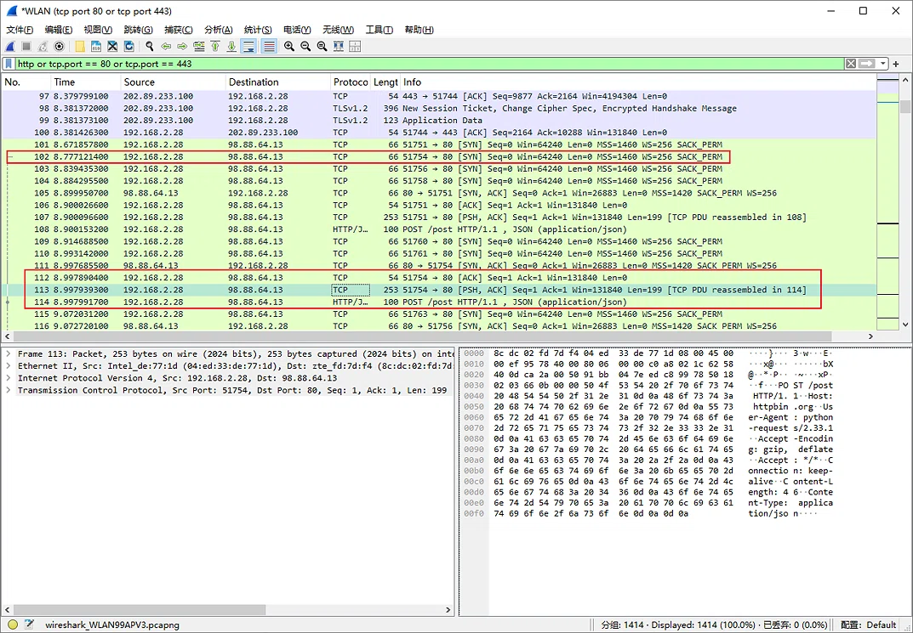

# 游戏登录接口并发测试分析报告

## 测试目标
模拟100个玩家同时登录，观察服务器响应时间变化。

## 测试环境
- Python 3.13 + Requests + ThreadPoolExecutor/ProcessPoolExecutor
- 目标接口：httpbin.org/post

## 线程测试结果
| 并发数 | 成功数 | 失败数 | 总耗时 | 平均响应时间 | 最大响应时间 |
|--------|--------|--------|--------|--------------|--------------|
| 100    | 100    | 0      | 2.40秒 | 0.663秒      | 2.189秒      |
| 100    | 99    | 1      | 4.88秒 | 1.032秒      | 4.647 秒      |
| 100    | 96    | 4      | 11.59秒 | 1.448秒      | 11.556秒      |
## 进程测试结果
| 并发数 | 成功数 | 失败数 | 总耗时 | 平均响应时间 | 最大响应时间 |
|--------|--------|--------|--------|--------------|--------------|
| 100    | 100    | 0      | 8.52秒 | 0.872秒      | 5.779秒      |
| 100    | 95    | 5      | 13.43秒 | 1.381秒      | 9.716秒      |
| 100    | 99    | 1      | 5.15秒 | 0.737秒      | 2.560秒      |
## 线程 vs 进程对比
| 方式   | 平均总耗时 | 平均响应时间 |
|--------|--------|--------------|
| 多线程 | 6.29秒 | 1.048秒      |
| 多进程 | 9.03秒 | 0.997秒      |

## TCP三次握手分析

## 结论
### 注：测试时由于网络波动或接口限流等因素，测试结果数据不一定准确，但总体上可以反映且推断出一些结论
1. 在IO密集型任务中，多线程足以应对并发请求。
2. 由于多进程总体总耗时大于多线程，验证了进程切换时开销远大于线程切换
3. TCP三次握手保证了连接的可靠性。
4. 多进程的平均单次响应时间反而略优于多线程，因为多进程互相独立，没有GIL的争抢，每个进程都能独立处理网络请求，所以单次请求的响应时间比较稳定。但多进程因为启动、调度、IPC通信开销巨大，导致总耗时依然远高于多线程。
